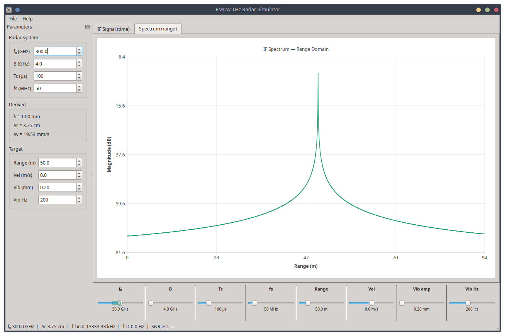

.. _index:

FMCW THz Radar GUI
===================

.. image:: https://github.com/ldv-1000111/fmcw-thz-radar-gui/actions/workflows/gui-ci.yml/badge.svg?branch=main
   :target: https://github.com/ldv-1000111/fmcw-thz-radar-gui/actions/workflows/gui-ci.yml
   :alt: GUI CI

.. image:: https://img.shields.io/badge/C%2B%2B-17-blue
   :alt: C++17

.. image:: https://img.shields.io/badge/Qt-6-green
   :alt: Qt6

.. image:: https://img.shields.io/badge/license-MIT-lightgrey
   :alt: MIT

**Author:** Luis Viveros · **Version:** 0.1.0 · **License:** MIT

A Qt6/C++ desktop application that drives the
`fmcw-thz-radar-sim <https://github.com/ldv-1000111/fmcw-thz-radar-sim>`_
Phase 1 physics engine through a graphical interface.  All radar parameters
are live-editable via spin boxes; plots update in real time using QtCharts.

The engine is consumed as a **git submodule** — no reimplementation of the
physics, no Python binding layer.  Changes to the engine repo flow into the
GUI on the next ``git submodule update``.

**Engine docs:** `fmcw-terahertz-radar-simulation.readthedocs.io <https://fmcw-terahertz-radar-simulation.readthedocs.io>`_

|

.. toctree::
   :maxdepth: 2
   :caption: Getting started

   getting_started/quickstart
   getting_started/architecture

.. toctree::
   :maxdepth: 2
   :caption: GUI guide

   gui/parameter_panel
   gui/slider_bar
   gui/plot_widget

.. toctree::
   :maxdepth: 2
   :caption: Reference

   reference/api
   reference/bibliography
